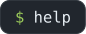
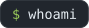
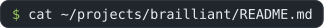
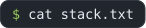
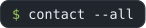

<!--
  INTERACTIVE TERMINAL README — neofetch style
  · The terminal card is assets/terminal.svg — a hand-authored SVG. The art
    inside it is the original braille bitmap (236x248 dots) emitted as vector
    rectangles, so nothing depends on the reader having a braille font.
  · Do NOT switch the panels below to ```ansi blocks: GitHub does not render
    ANSI escapes in markdown, they show up as literal [38;5;209m text.
  · The command chips are SVGs because GitHub offers no way to enlarge
    <summary> text (styles are stripped; a heading's 24px margin drops the
    disclosure triangle onto its own line). align="middle" centres the triangle
    on the chip, and the href-less <a name> wrapper stops GitHub auto-linking
    the image — an auto-linked chip opens the SVG instead of expanding.
  · Every "$ command" below is a <details> block: it expands inline, no JS.
    Those panels are ```yaml, so GitHub colours keys/values/comments for free
    and follows the reader's light or dark theme.
-->

<p align="center">
  
</p>

<samp>

<details>
<summary><a name="cmd-help"></a> &nbsp;<sub>start here</sub></summary>

<br>

```yaml
available commands:
  whoami        : who I am, in four lines
  ls ~/projects : things I have built
  cat stack.txt : languages, frameworks, tools
  contact --all : where to find me

# click any command to expand it · click again to collapse
```

</details>

<details>
<summary><a name="cmd-whoami"></a></summary>

<br>

```yaml
Mahinur Mahi:
  school   : University of South Florida — CS, sophomore
  building : full-stack apps, and learning Spring Boot
  learning : ML in Python, plus hardware that talks to the web
  off-clock: sensors, solenoids, and small tools that get used
```

</details>

<details>
<summary><a name="cmd-projects"></a></summary>

<br>

| project | what it does | stack | |
|---|---|---|---|
| **[Brailliant](https://github.com/Mahinur26/Brailliant)** | camera or PDF in, braille dots out | `FastAPI` `ESP32` | [repo](https://github.com/Mahinur26/Brailliant) · [demo](https://www.youtube.com/watch?v=eGkaFCZrKGw) |
| **[PathSense](https://github.com/Mahinur26/PathSense)** | LiDAR cane that steers by haptics | `SwiftUI` `ARKit` | [repo](https://github.com/Mahinur26/PathSense) |
| **[Library Tracker](https://github.com/Mahinur26/USF-Library-Tracker)** | live floor counts from IR sensors | `Next.js` `Firebase` | [repo](https://github.com/Mahinur26/USF-Library-Tracker) |
| **[Food Pantry](https://github.com/Mahinur26/Food-Pantry)** | scans groceries, tracks expiry dates | `React` `YOLO` | [repo](https://github.com/Mahinur26/Food-Pantry) · [live](https://food-pantry-eight.vercel.app) |

<details>
<summary><a name="cmd-cat"></a></summary>

<br>

```yaml
Brailliant:
  problem : braille hardware is expensive and rarely within reach
  approach: camera, screenshot, or PDF → text → UEB grade-1 dots →
            six solenoids driven over serial by an ESP32
  result  : one physical cell you step through letter by letter, and
            the whole pipeline still runs with no hardware attached
```

</details>

</details>

<details>
<summary><a name="cmd-stack"></a></summary>

<br>


</details>

<details>
<summary><a name="cmd-contact"></a></summary>

<br>

<pre>
contact:
  github  : <a href="https://github.com/Mahinur26">github.com/Mahinur26</a>
  email   : mahinurmahi26@gmail.com
  linkedin: <a href="https://www.linkedin.com/in/mahinur-mahi">linkedin.com/in/mahinur-mahi</a>
  status  : open to internships and side projects
</pre>

</details>

</samp>
